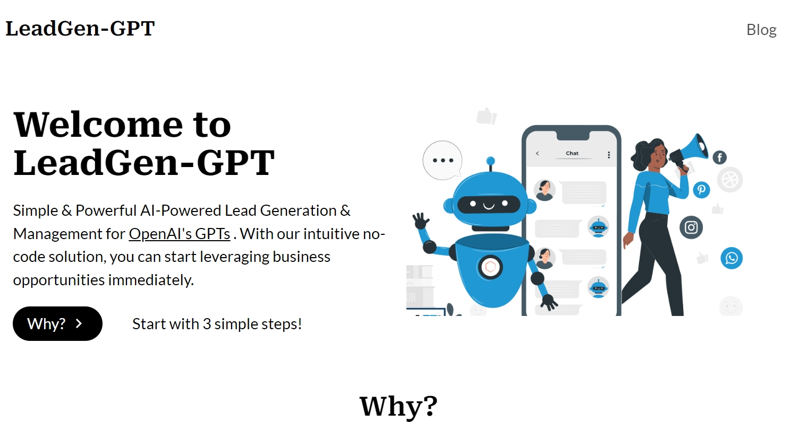

 

  

 

# LeadGen-GPT

Simple & Powerful AI-Powered Lead Generation & Management for OpenAI's GPTs . With our intuitive no-code solution, you can start leveraging business opportunities immediately.

## Why?

Every small to medium-sized business and individual entrepreneur can instantly create an intelligent assistant using OpenAI’s GPTs. These assistants provide smart, convenient services to customers within minutes, enhancing user experience and engagement. But how do you capture and manage the valuable leads that your service generates?

Our platform empowers businesses and individual users to effortlessly collect, manage, and utilize leads without any need for coding or technical development. With our intuitive no-code solution, you can start leveraging business opportunities immediately.

## How?

Transform your GPTs into powerful lead generation tools with LeadGen-GPT. This guide outlines a straightforward, three-step process to enhance your digital services with advanced AI capabilities, ensuring you capture and manage leads effectively and efficiently.

1. Define Your Requirements
2. Connect Your GPTs
3. Receive Notifications and Monitor Your Leads

## Support

Please feel free to post issues or submit PRs to this repo and we will do our best to respond in a timely manner.
